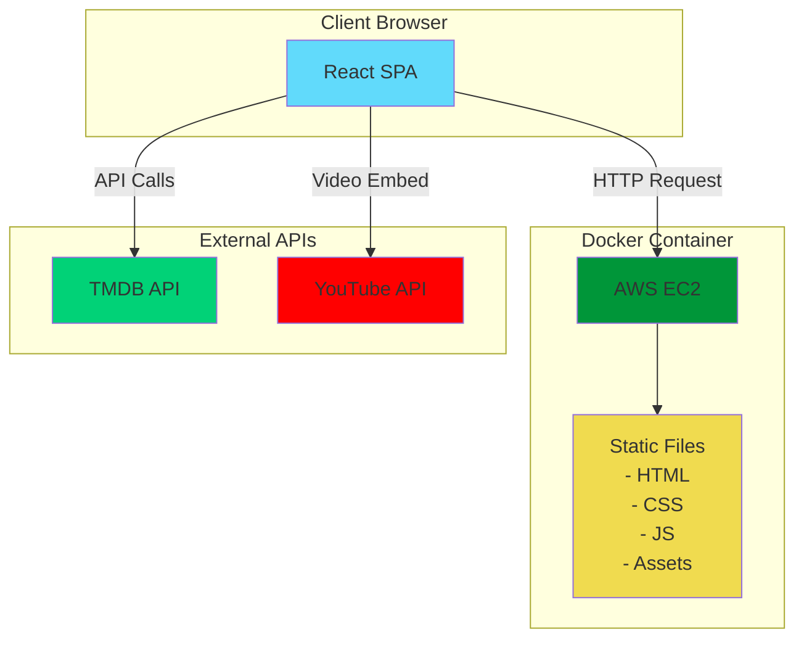

## 1. 프로젝트 개요

### 1.1 프로젝트 명

Netflix Clone - React & TMDB API

### 1.2 프로젝트 목표

- Netflix UI/UX를 모방한 영화 스트리밍 서비스 웹 애플리케이션 구현
- React를 활용한 SPA(Single Page Application) 개발
- TMDB API를 통한 실시간 영화 데이터 연동
- Docker 컨테이너화를 통한 배포

### 1.3 주요 기능

- 영화/TV 프로그램 목록 표시
- 카테고리별 콘텐츠 분류
- 콘텐츠 검색 기능
- 콘텐츠 상세 정보 표시
- 반응형 웹 디자인
- 트레일러 재생 (YouTube API 연동)

## 2. 기술 스택

### 2.1 Frontend

- **React 18.x**: UI 라이브러리
- **React Router v6**: 라우팅 관리
- **Redux Toolkit**: 상태 관리
- **Axios**: HTTP 클라이언트
- **Styled-components / Tailwind CSS**: 스타일링
- **React Query**: 서버 상태 관리
- **TypeScript**: 타입 안정성

### 2.2 API

- **TMDB API**: 영화 데이터 소스

### 2.3 개발 도구

- **Vite**: 빌드 도구
- **ESLint & Prettier**: 코드 품질 관리
- **Docker**: 컨테이너화
- **Nginx**: 정적 파일 서빙

### 2.4 전체 시스템 아키텍처



## 3. 프로젝트 구조

```
netflix-clone/
├── public/
├── src/
│   ├── api/
│   │   ├── axios.js
│   │   └── requests.js
│   ├── components/
│   │   ├── MovieModal/
│   │   │   ├── index.js
│   │   │   ├── MovieModal.css
│   │   ├── Nav.js
│   │   ├── Nav.css
│   │   ├── Banner.js
│   │   ├── Banner.css
│   │   ├── footer.js
│   │   ├── Row.js
│   │   └── Row.css
│   ├── hooks/
│   │   ├── useDebounce.js
│   │   └── useOnClickOutside.js
│   ├── pages/
│   │   ├── DetailPage/
│   │   │   └── index.js
│   │   ├── MainPage/
│   │   │   └── index.js
│   │   └── SearchPage/
│   │       ├── SearchPage.css
│   │       └── index.js
│   ├── App.js
│   └── main.js
├── .env
├── .dockerignore
├── Dockerfile
└── package.json

```

## 4. 주요 페이지 및 기능

### 4.1 홈 페이지

- Hero 배너: 인기 콘텐츠 하이라이트
- 카테고리별 슬라이더:
    - Netflix Originals

### 4.2 영화/TV 프로그램 페이지

- 장르별 필터링
- 무한 스크롤
- 그리드 레이아웃

### 4.3 검색 페이지

- 실시간 검색
- 검색 결과 표시
- 필터 옵션

### 4.4 상세 페이지

- 콘텐츠 정보 (제목, 개요, 평점, 출시일)
- 트레일러 재생

## 5. API 구조

### 5.1 TMDB API 엔드포인트

```jsx
const API_KEY = process.env.REACT_APP_TMDB_API_KEY;
const BASE_URL = '<https://api.themoviedb.org/3>';

// 주요 엔드포인트
- /movie/popular
- /movie/top_rated
- /movie/now_playing
- /tv/popular
- /tv/top_rated
- /search/multi
- /movie/{movie_id}
- /movie/{movie_id}/similar
- /movie/{movie_id}/videos

```

### 5.2 API 호출 모듈

```jsx
import axios from "axios";

const instance = axios.create({
    baseURL: "https://api.themoviedb.org/3",
    params: {
        api_key: process.env.REACT_APP_API_KEY,
        language: "ko-KR",
    },
});

export default instance;
```

## 6. Docker 배포 설정

### 6.1 Dockerfile

```
# Use the latest LTS version of Node.js
FROM node:18-alpine

# Set the working directory inside the container
WORKDIR /app

# Copy package.json and package-lock.json
COPY package*.json ./

# Install dependencies
RUN npm i -g react-scripts
RUN npm install

# Copy the rest of your application files
COPY . .

# Expose the port your app runs on
EXPOSE 3000

# Define the command to run your app
CMD ["npm", "start"]
```

## 7. 개발 일정

### Phase 1: 기초 설정

- 프로젝트 초기 설정
- TMDB API 키 발급 및 테스트
- 기본 라우팅 구조 설정
- 컴포넌트 폴더 구조 생성

### Phase 2: 핵심 기능 개발

- 홈 페이지 구현
- 영화 목록 페이지 구현
- 검색 기능 구현
- 상세 페이지 구현

### Phase 3: UI/UX 개선

- 반응형 디자인 적용
- 로딩 상태 및 에러 처리
- 애니메이션 추가
- 성능 최적화

### Phase 4: 배포

- Docker 이미지 빌드
- 테스트 및 디버깅
- 최종 배포

## 8. 환경 변수 설정

`.env` 파일:

```
REACT_APP_TMDB_API_KEY=your_tmdb_api_key
```

## 9. 주의사항 및 제약사항

1. **API 제한**: TMDB API 무료 티어 요청 제한 고려
2. **저작권**: 실제 Netflix 로고 및 브랜딩 사용 제한
3. **기능 제한**: 실제 비디오 스트리밍 불가 (트레일러만 가능)
4. **인증**: 백엔드가 없으므로 실제 사용자 인증 시스템 구현 불가

## 10. 향후 확장 가능성

1. **사용자 기능**: LocalStorage를 활용한 찜하기 기능
2. **다국어 지원**: i18n 라이브러리 도입
3. **PWA**: Progressive Web App으로 전환
4. **성능 개선**:
    - 이미지 레이지 로딩
    - 코드 스플리팅
    - 서비스 워커 도입

## 11. 배포 링크 
- 현빈 : http://43.200.3.93:80 